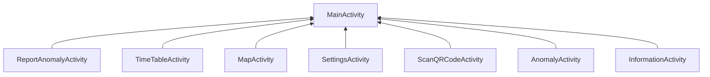
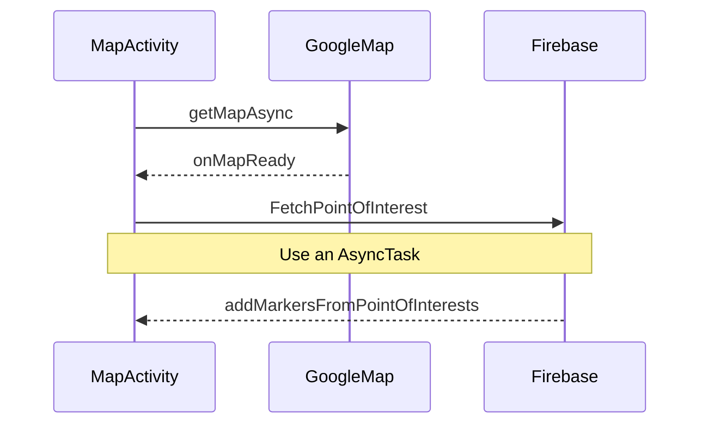
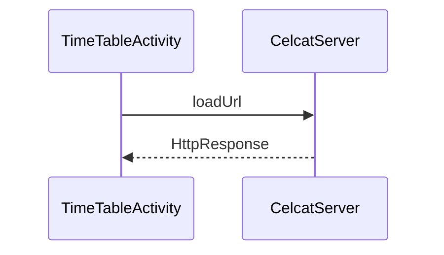
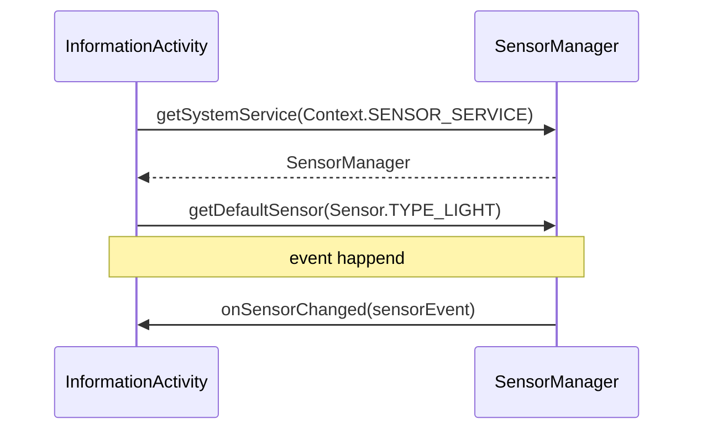

# Document d'architecture de l'application

NOTE: Certain des diagrammes ci-dessous utilise [mermaid](https://mermaidjs.github.io). Vous devez vous prémunir d'un visualisateur fournis par un plugin de votre IDE  ou utiliser le [Mermaid Live Editor](https://mermaidjs.github.io/mermaid-live-editor) (Github est capable de faire la preview).

## Structure des packages

```java
|-- app
|   |-- MainActivity
|   |-- MapActivity
|   |-- ....Activity
|   |-- services
|   |-- models
|   |   |-- PointOfInterest.java
|   |   |-- Anomaly.java
|   |   |-- *.java
|   `-- utils
|       |-- PermissionUtils.java
|       |-- FirebaseUtils.java
|       `-- *.java
```

Nous avons 3 packages:

- _models_

Contient tout les `Data Access Objec` (DAO) utilisé dans l'application. C'est `Class` on pour but d'être sérialisé en base de donnée.

- _utils_

Fonctions utilitaires pour faciliter et partager du code.

- _services_ (peu utilisé)

Des interfaces offrant des services vers des services externes comme `Firebase`.

## Hiérarchie des activités



La `MainActivity` ne sert juste que d'interface home par laquelle on lance les autres activités.
Pour isoler les contextes nous avons préféré utiliser des `AppCompatActivity` au lieu de `Fragment`.


### Librairies

Le SDK Android et sa librairie standard étant assez fournis. Nous avons fait le choix de se limiter à leurs utilisations et d'éviter des librairies externes écritent par des tiers.

## Architecture des activitées

### MapActivity

> 1. Géolocalisation des batiments/amphis : Utilisation FireBase pour stocker les
> noms (au moins U1 à U4), OpenStreetMap pour la partie carte (ou google
> maps si trop compliqué). On pourra rechercher un lieu et marquer un point
> d’intéret.

Nous avons décidé de partir sur `Google Map` car la librairie fournit par Google est plus simple à prendre en main, grâce à leur documentation complète.

Les `point d’intéret` sont materialisés par des [Marker](https://developers.google.com/android/reference/com/google/android/gms/maps/model/Marker) fournit par Google Map.

Pour la recherche de points d’intérets nous avons décidé d'utiliser [SearchView](https://developer.android.com/reference/android/widget/SearchView.html) fournis par le SDK pour avoir un bouton de recherche dans le `Menu` de notre `ActionBar`.


#### Diagramme de séquence



NOTE: Les points d’intéret ne sont pour l'instant par sauvegardé sur `Firebase`.

### TimeTableActivity

> 2. Interrogation des EdT de l’Université : Interaction HTTP + Interface
> Graphique

Nous récupérons la view de l'emploi du temps de l'utilisateur dans un `WebView`.
Une solution simple à mettre en place car les emplois du temps fournis par la fac peuvent être `embed`.

#### Diagramme de séquence



### ScanQRCodeActivity

> 3. Information : Utilisation d’un QR Code qui afche une page web ou des
> données d’une base FireBase (soit texte, index frebase, soit url et dans ce
> cas n’importe quel site).

TODO

### ReportAnomalyActivity

> 4. Détection d’anomalie : On prend une photo qui est géolocalisée et orientée
> avec un niveau de criticité (Confort, Problème, Danger). L’utilisateur peut
> tracer une boite pour préciser l’endroit sur l’image. Le tout est envoyé sur
> une base FireBase en basse résolution.

### SettingsActivity

> 5. Confguration : Si vous devez mettre des informations
> (login/mdp/formation/url de l’edt/...)

TODO


### InformationActivity

> 6. Information : Vos photos, noms, et le logo du Master DL, le niveau sonore
> et la luminosité ambiante

#### luminosité ambiante

Nous récupérons la luminosité ambiante par l'API [SensorManager](https://developer.android.com/reference/android/hardware/SensorManager.html).

##### Diagramme de séquence:



#### niveau sonore

Nous n'avons pas réussi à implementer cette feature. Nous avions pour idée d'utiliser un [MediaRecorder](https://developer.android.com/guide/topics/media/mediarecorder.html) dans une `AsyncTask` et d'utiliser la méthode [getMaxAmplitude](https://developer.android.com/reference/android/media/MediaRecorder.html#getMaxAmplitude()) pour récupérer le niveau sonore.


NOTE: Nous n'avons pas voulu mettre nos photos sur l'application donc nous avons mis une icone svg pour remplacer.


## Services externes

### Firebase accès

### Google Map accès

Nous utilisons une [API Key](https://github.com/kladier/miniprojet-android/blob/1835a42fd5aa8f286532476b29b1501219efbc7f/app/src/main/AndroidManifest.xml#L44) pour charger la google map dans un `Fragment`. A l'heure actuelle la `key` n'est pas chiffré et il faudrait suivre ces [procédures](https://developers.google.com/maps/documentation/android-api/signup) pour la chiffrer avec un `SHA-1`.