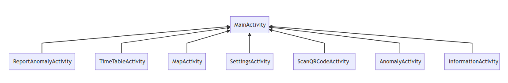
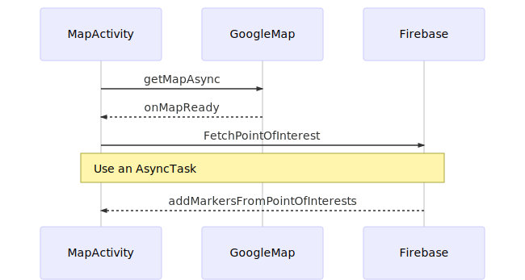
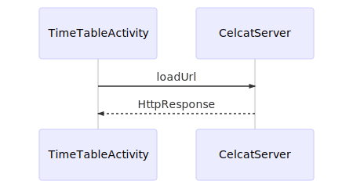
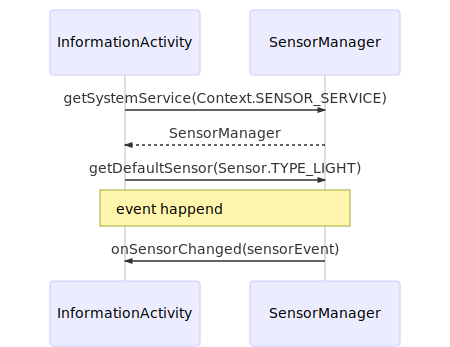

# Document d'architecture de l'application

NOTE: Les diagrammes ci-dessous ont été fait avec [mermaid](https://mermaidjs.github.io).

## Structure des _packages_

```java
|-- app
|   |-- MainActivity
|   |-- MapActivity
|   |-- ....Activity
|   |-- services
|   |-- models
|   |   |-- PointOfInterest.java
|   |   |-- Anomaly.java
|   |   |-- *.java
|   `-- utils
|       |-- PermissionUtils.java
|       |-- FirebaseUtils.java
|       `-- *.java
```

Nous avons 3 _packages_:

- _models_

Contient tous les `Data Access Objec` (DAO) utilisés dans l'application. Ces `Class` ont pour but d'être sérialisées en base de données.

- _utils_

Fonctions utilitaires pour faciliter et partager du code.

- _services_ (peu utilisé)

Des interfaces offrant des services vers des services externes comme `Firebase`.

## Hiérarchie des activités



La `MainActivity`sert de page d'accueil par laquelle on lance les autres activités.
Pour isoler les contextes, nous avons préféré utiliser des `AppCompatActivity` au lieu de `Fragment`.

Toutes les activitées sont `Children` de `MainActivity`:

_Voir cet exemple:_
```java
<activity android:name=".*Activity"
    android:parentActivityName="univ.pr.nj.keewitz.MainActivity">
            ^^^^^^^^^^^^^^^^^^
</activity>
```

De plus, elles utilisent un [Up Navigation](https://developer.android.com/training/implementing-navigation/ancestral.html) qui offre un bouton en forme de flêche, situé sur la barre de `Menu`, pour revenir à la (page d'accueil) `MainActivity`.

### Librairies

Le SDK Android et sa librairie standard étant assez fournis, nous avons fait le choix de se limiter à leurs utilisations et d'éviter des librairies externes écrites par des tiers.

## Architecture des activités

### MapActivity

> 1. Géolocalisation des batiments/amphis : Utilisation FireBase pour stocker les
> noms (au moins U1 à U4), OpenStreetMap pour la partie carte (ou google
> maps si trop compliqué). On pourra rechercher un lieu et marquer un point
> d’intéret.

Nous avons fait le choix technique d'utiliser `Google Map`. La librairie fournie par Google est plus simple à prendre en main grâce à sa documentation complète.

Les `points d’intérets` sont materialisés par des [Marker](https://developers.google.com/android/reference/com/google/android/gms/maps/model/Marker) fournis par Google Map.

Pour la recherche de points d’intérets, nous avons décidé d'utiliser [SearchView](https://developer.android.com/reference/android/widget/SearchView.html) fournis par le Android SDK pour avoir un bouton de recherche dans le `Menu` de notre `ActionBar`.


#### Diagramme de séquence



NOTE: Les points d’intérets ne sont pour l'instant pas sauvegardés sur `Firebase`.

### TimeTableActivity

> 2. Interrogation des EdT de l’Université : Interaction HTTP + Interface
> Graphique

Nous récupérons la _view_ de l'emploi du temps de l'utilisateur dans un `WebView`,
une solution simple à mettre en place car les emplois du temps fournis par l'université peuvent être: `embed`.

L'emploi du temps affiché est selon la formation choisie dans les Settings.


#### Diagramme de séquence




### ScanQRCodeActivity

> 3. Information : Utilisation d’un QR Code qui affiche une page web ou des
> données d’une base FireBase (soit texte, index firebase, soit url et dans ce
> cas n’importe quel site).

En cliquant sur QrCode depuis la page d'accueil, l'appareil photo se lance pour vous permettre de prendre en photo un QRCode correspondant à un cours en ligne.

Une fois la photo prise et si le QRCode est correctement détecté, le cours s'affiche directement sur l'application via une WebView.
On se sert du visualisateur PDF en ligne proposé par Google.

Trois exemples de QRCode correspondant à un cours en ligne au format PDF sont disponibles, à titre d'exemple dans le dossier "app/res/drawable"

Remarque : le BarcodeScanner proposé par Android est peu performant, il faut parfois s'y prendre à plusieurs reprises pour que le QRCode soit détecté. 

### ReportAnomalyActivity

> 4. Détection d’anomalie : On prend une photo qui est géolocalisée et orientée
> avec un niveau de criticité (Confort, Problème, Danger). L’utilisateur peut
> tracer une boite pour préciser l’endroit sur l’image. Le tout est envoyé sur
> une base FireBase en basse résolution.

Un spinner permet de choisir parmi les 3 niveaux de criticité. Un bouton permet de prendre une photo, qui est ensuite affichée au milieu de l'écran.
Elle est mise à jour à chaque fois que l'on prend une nouvelle photo.
Si aucune photo n'a été prise, on affiche un message d'erreur lorsque l'utilisateur appuie sur le bouton de soumission. Sinon, il renvoie au menu principal, et stocke la photo dans le stockage Firebase.
Dans la base de données, on stocke aussi le nom de l'image, ainsi que le niveau de criticité et l'url de l'image dans le stockage Firebase.

Le dessin de rectangle pour préciser la zone n'a pas été implementé. La géolocalisation de la photo n'est pas non plus récupérée et donc stockée, mais il y a en place les éléments permettant de le faire.

### SettingsActivity

> 5. Confguration : Si vous devez mettre des informations
> (login/mdp/formation/url de l’edt/...)

Deux réglages sont possibles : 

    1) le nom d'utilisateur (qui est affiché dans la home page)

    2) une formation (à titre d'exemple, 3 sont proposées : M2 DL, M1 DL et L3 info)
    
Remarque 1 : un bug que nous n'avons pas réglé est que si l'on change de formation et qu'on revient dans les Settings, c'est la formation M2 DL qui est proposé par défaut dans le formulaire (à la place de la formation préalablement choisie).

Remarque 2 : il n'y a pas de bouton de validation, les changements sont pris en compte directement et il suffit de revenir sur la home page pour continuer sa navigation dans l'application.

### InformationActivity

> 6. Information : Vos photos, noms, et le logo du Master DL, le niveau sonore
> et la luminosité ambiante

#### luminosité ambiante

Nous récupérons la luminosité ambiante par l'API [SensorManager](https://developer.android.com/reference/android/hardware/SensorManager.html).

##### Diagramme de séquence:



#### niveau sonore

Nous n'avons pas réussi à implementer cette feature. Nous avions pour idée d'utiliser un [MediaRecorder](https://developer.android.com/guide/topics/media/mediarecorder.html) dans une `AsyncTask` et d'utiliser sa méthode [getMaxAmplitude](https://developer.android.com/reference/android/media/MediaRecorder.html#getMaxAmplitude()) pour récupérer le niveau sonore.


NOTE: Nous n'avons pas voulu mettre nos photos sur l'application, nous les avons remplacées par une icône svg.


## Services externes

### Firebase accès

### Google Map accès

Nous utilisons une [API Key](https://github.com/kladier/miniprojet-android/blob/1835a42fd5aa8f286532476b29b1501219efbc7f/app/src/main/AndroidManifest.xml#L44) pour charger la google map dans un `Fragment`. Pour l'instant, la `key` n'est pas chiffrée et il faudrait suivre ces [procédures](https://developers.google.com/maps/documentation/android-api/signup) pour la chiffrer avec en empreinte `SHA-1`.