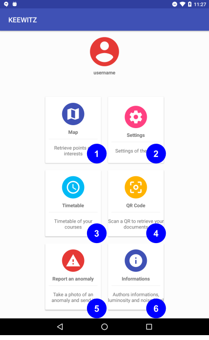

# Guide utilisateur

Une application pour faciliter votre vie d'étudiant sur le campus de l'Université Paul Sabatier.

# Aperçu de l'application

➊ Trouver les points d'intérêts (Bibliothèque) sur le campus et chercher l'emplacement de vos salles de cours.

➋ Modifier vos paramètres personnels qui seront utilisés par d'autres services de cette application.

➌ Retrouver l'emploi du temps Celcat de vos cours.

➍ Retrouver vos documents en scannant un QR code.

➎ Aider nous à traquer les problèmes de l'université en rapportant les anomalies.

➏ Les informations sur les auteurs de cette application et la valeur de la luminosité ambiante.

## Installer l'application

L'application n'est actuellement pas disponible sur le Google Play store.
Pour l'installer, il faudra la compiler directement avec les sources et installer l'apk sur votre smartphone.

## Information additionnelle

- Dernière modification: jeudi, 15 Mars 2018

- Requière une version Android 6.0 au minimum

- Version actuelle: `1.0.0`

- Permissions:
  - Accès internet
  - Localisation GPS et internet
  - Lire le stockage externe

- Aucune publicité

## Licence

L'application est sous [license MIT](../LICENSE)